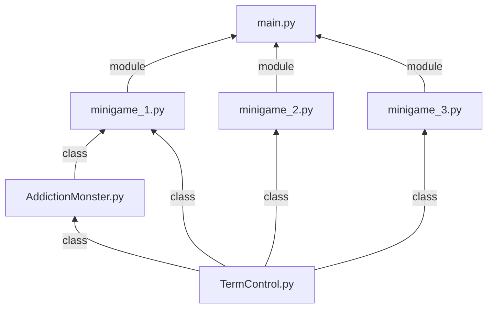

# CTD-1D
Team 07 - 3 Hard and Irresistable Games

Members: Alexander Lee, Nathan Ly, Nathaniel Neo,  Roshan S/O Manogaran,  Vamshi Krishna, and Wong Guo Yao

# Description 

Scenario: This game is aimed with the ojective of raising awareness on different mental illnesses through the trial of gaming. This is to help raise awareness for people and to give an insight on how certain mental illnesses can affect an individual. This software will be providing 3 different mini-games.
## Overview

This app aims to raise awareness on different mental illnesses through the trial of gaming. This is to help raise awareness for people and to give an insight on how certain mental illnesses can affect an individual. This software will be providing 3 different mini-games.

## How to install and run the app

Firstly, make sure that you have `python` installed on your machine. You can check which `python` version is installed by opening the terminal and running:
```bash
python3 --version
```

Clone this repository to your machine.
```bash
git clone https://www.github.com/Darkuantum/CTD-1D.git
```

Navigate into the repository directory.
```bash
cd CTD-1D/
```

Run the app.
```bash
python3 main.py
```

## Project dependency flowchart

Below is a dependency flowchart on how each modules in the project are related to each other as imports.


## Description for each mini-game

### Minigame 1
This game is aimed with the ojective of raising awareness on different mental illnesses through the trial of gaming. This is to help raise awareness for people and to give an insight on how certain mental illnesses can affect an individual. This software will be providing 3 different mini-games. Our reason for this game is our friend Justin who has a problem with dealing with his vices. He is unable to understand how his vices are destroying his physical and mental health, as well as his loved ones around him. Hence, we aim to give him a better understanding of his actions.

**Minigame 1 documentation**


## Description of Minigame 1:

### Scenario:
This game is aimed with the ojective of raising awareness on different mental illnesses through the trial of gaming. This is to help raise awareness for people and to give an insight on how certain mental illnesses can affect an individual. This software will be providing 3 different mini-games. Our reason for this game is our friend Justin  who has a problem with dealing with his vices. He is unable to understand how his vices are destroying his physical and mental health, as well as his loved ones around him. Hence, we aim to give him a better understanding of his actions.
Description of the game:

This game is themed towards three addictions, specifically smoking/vaping, gambling and alcohol. The manner of the game is a Q/A structure with yes/no questions. To make it challenging and fun, each addiction scenario takes the form of a monster, and the player will have limited lives while 'battling them'. Each wrong answer will also give a surprise debuff to the players ability to answer the next question, and getting it correct will remove the debuff. If all lives are lost, the player will lose against the monsters and can retry the game.


## Documentation Of Game


## Documentation Of Game


### Minigame 2

Mini-game 2 runs through a set of words that requires the player to memorise within a time limit, afterwards the words will appear and the user will have to type them in order. This is to help replicate the short term memory of a patient with Alzhimer which is directly linked to dementia. Each time the player gets the answer correct, it will go down a list of harder words based of the initial difficulty they have chosen. 

**Minigame 2 documentation**

`import random` - This library helps to select a random element from a sequence. <br/> 
`import time` - This library allows the programmer to handle time-related operations. <br/>
`from TermControl import TermControl` - This library helps to implement basic operations for analysis and design of a feedback control systems. <br/>
`from copy import deepcopy` - This helps to import the data from the library of copy and specifically the function deepcopy into. <br/>
`tc = TermControl` - Creating an object from the class `TermControl` to handle terminal controls.
 
 - The dictionary is pulled to get the words for the user to memorise, it is also pulled to randomise to give it in random order for the user to know how to spell the words 

`def randomiser (difficulty, numWins)` - This function is called to randomise the list in the dictionary, firstly it will take the current list that is being used, create a deepcopy of it to ensure that the dictionary is not modified, randomise the contents in the list. Then it returns the randomised list. 


`def countdown(t) -> None:` - This function is called to set a timer that counts down to restrict the amount of time the user has to memorise the words. Firstly it takes the tuple and divide t into 60, then it is seperated into minutes and seconds. Afterwards it is printed to display to the user. Afterwards it will count until t reaches 0. 


`def print_prompts(dictionary, numWins, timer) -> None:` - This function takes in 3 different inputs, *dictionary*, *numWins*, *timer*. It is then used to display and print the words that need to memorised. First it pulls the function TermControl and change the words to the Cyan color, it then helps to print the word from the dictionary, then it will countdown and then clear the screen. Afterwards it will set the color magenta for the words that have been randomised that is referenced from the dictionary, then it will also print the numWins. After everything has been ran, it will reset the color. 

`def filter(response) -> list:` - This function is meant to help check the user response from the terminal, firstly it will check if there are "," in the response. This is to give a more vaired response incase the user uses commas between the words. If there is a comma, the function will replace the comma with a " ". It will also check if the character is an alphabet or a space, if it is `True` it will continue. If there is any other rsponse that is not valid, it will return a `False`. Examples are *., ?, /, #, @, %, &, ()* or any other invalid symbols that don't match " " or ",". Afterwards `response.split()` will be used to convert the filtered response into a list. 

`def verify (dictionary, numWins) -> bool:` - This function just stores the a `message_dict` that has 10 responses to prompt and taunt the user. It will then randomise the from the dictionary and print the message. Then it will wait for the response from the use, and reply back witht the user's response. While the cleaned_response is `False` it will change the color to red and then orint that the response is invalid. then it will ask the user to only input the alphabets. After this it will wait for a new response, then it will filter the response and put it back into the new variable. It then compares between the filtered response and the dictionary to check if the user is correct. If the user is correct it will return `True` else it will return `False` 

`def alzheimerGame() -> None:` - This is the function for mini-game 2. It will first ask for the users difficulty and adjust the timing accordingly, then it will prompt the user for its input, if the input is not correct the user will lose a life, if the user loses all lives the user automatically loses. If the user is correct, the user will move forward to the next stage. After the game is over, the user wil move back to the main game. 

### Minigame 3 
