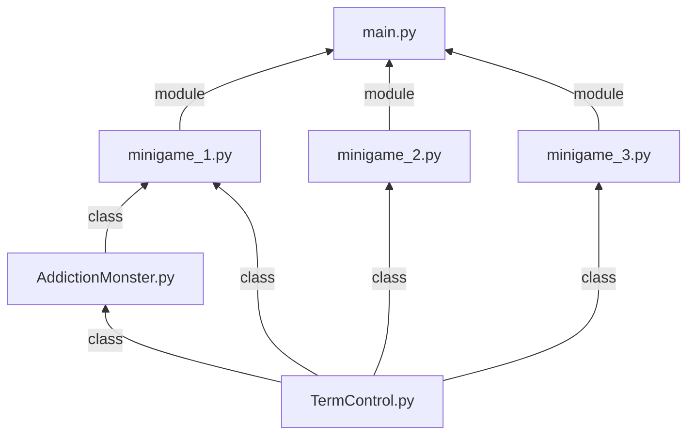
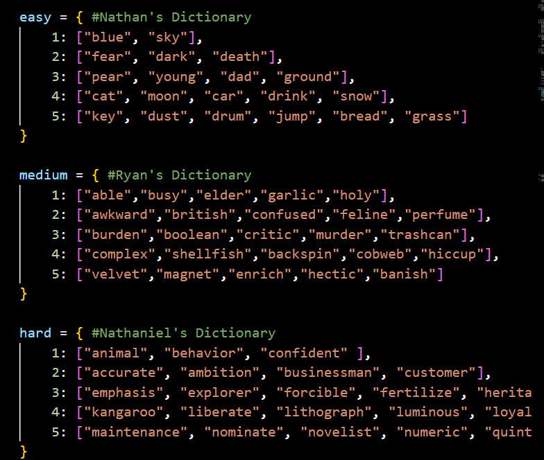

# CTD-1D
Team 07 - 3 Hard and Irresistable Games

Members: Alexander Lee; Nathan Ly; Nathaniel Neo; Roshan S/O Manogaran; Thatikonda Venugopal Vamshi Krishna; Wong Guo Yao; Cheong Kai Jun Ryan

# Description 

Scenario: This game is aimed with the ojective of raising awareness on different mental illnesses through the trial of gaming. This is to help raise awareness for people and to give an insight on how certain mental illnesses can affect an individual. This software will be providing 3 different mini-games.

## Overview

This app aims to raise awareness on different mental illnesses through the trial of gaming. This is to help raise awareness for people and to give an insight on how certain mental illnesses can affect an individual. This software will be providing 3 different mini-games.

## How to install and run the app

Firstly, make sure that you have `python` installed on your machine. You can check which `python` version is installed by opening the terminal and running:
```bash
python3 --version
```

Clone this repository to your machine.
```bash
git clone https://www.github.com/Darkuantum/CTD-1D.git
```

Navigate into the repository directory.
```bash
cd CTD-1D/
```

Run the app.
```bash
python3 main.py
```

## Project dependency flowchart

Below is a dependency flowchart on how each modules in the project are related to each other as imports.


## Description for each minigame

### Minigame 1:

This game is aimed with the ojective of raising awareness on different mental illnesses through the trial of gaming. This is to help raise awareness for people and to give an insight on how certain mental illnesses can affect an individual. This software will be providing 3 different mini-games. Our reason for this game is our friend Justin  who has a problem with dealing with his vices. He is unable to understand how his vices are destroying his physical and mental health, as well as his loved ones around him. Hence, we aim to give him a better understanding of his actions.
Description of the game:

This game is themed towards three addictions, specifically smoking/vaping, gambling and alcohol. The manner of the game is a Q/A structure with yes/no questions. To make it challenging and fun, each addiction scenario takes the form of a monster, and the player will have limited lives while 'battling them'. Each wrong answer will also give a surprise debuff to the players ability to answer the next question, and getting it correct will remove the debuff. If all lives are lost, the player will lose against the monsters and can retry the game.

#### Minigame 1 (`AddictionMonster.py`) Documentation:

`import random` - This library helps in generating random numbers and selecting random elements from a sequence, used to randomize question order. <br/>
`from TermControl import TermControl` - This module provides terminal control functionality to change text color and clear the screen. <br/>
`class AddictionMonster:` - This class is used to manage the attributes and methods of each addiction monster in the game. <br/>
`def __init__(self, name, monster_hp=100, player_hp=100):` - Initializes the monster object with a name, starting health (100), and the player's starting health (100). <br/>
`def battle(self, qna: dict, debuff_dd: dict, debuffFn, lives: int):` - This function takes in 4 inputs:
    * *qna*: Dictionary containing questions and answers for all monsters.
    * *debuff_dd*: Dictionary with the debuff flag.
    * *debuffFn*: Function to apply the debuff if needed.
    * *lives*: Remaining player lives. 

It then conducts a battle sequence between the player and the monster using a series of questions from the provided *qna* dictionary. The player must correctly answer 5 yes/no questions to defeat the monster while managing their remaining lives. The function uses the *debuff_dd* dictionary to track and apply debuffs through the *debuffFn* function when the player answers incorrectly. It returns a tuple: a boolean indicating whether the player won the battle and the updated number of lives.

The function begins by introducing the monster battle and extracting the relevant questions for the monster based on its name. In a `for` loop, each question is presented to the player, applying a debuff if `debuff_dd['sight']` is active. The player's input is validated in a nested while loop to ensure only 'yes' or 'no' responses are accepted. Incorrect inputs prompt error messages in red text using `TermControl` (`tc`), while valid inputs are accepted as the player's answer

If the player's answer is correct, the monster's health decreases by 20, the sight debuff is disabled (`debuff_dd['sight'] = False`), and progress is displayed. Else, incorrect answers reduce the player's health by 25, enable the sight debuff, and print updated stats. The function checks for win/lose conditions after each question: the player wins if the monster's health (`monster_hp`) reaches zero, and the player loses if their health (`player_hp`) drops to zero.

If the player exhausts all questions without defeating the monster, they lose one life. A status message summarizes their performance, and color-coded feedback indicates whether lives remain or the game ends. The function concludes by returning the battle outcome (`True/False`) and the updated number of `Lives`. This comprehensive loop integrates player validation, debuff mechanics, and health tracking, forming a dynamic and interactive battle system. <br/>

#### Minigame 1 (`minigame_1.py`) Documentation

`from AddictionMonster import AddictionMonster` - Imports the AddictionMonster class to create and manage battles against addiction monsters. <br/>
`from TermControl import TermControl` - Allows changing text colors and clearing the terminal screen during gameplay.

**Dictionaries** <br/>
`qna` - A dictionary mapping monster names to their respective questions and answers. <br/>
`encryption_dict` - A dictionary defining how each letter is replaced during the "sight debuff." For example, 'a': '@', 'b': '6'. <br/>
`debuff_dict` - Tracks the active status of the "sight debuff." Example: {'sight': True}. <br/>

**Functions** <br/>
`def sightDebuff(question) -> str` - this function takes in 1 input, *question*, and applies a debuff by encrypting the input if the value in `debuff_dict` in `False`. This is done using `encryption_dict`. It then returns the encrypted question as a prompt for the player to answer. 

`def gameStart() -> bool` - This function prints an introductory message for the game and validates the player's input. The player is asked whether they are ready to proceed, and the function returns `True` if the input starts with "y" or "Y" (indicating "yes"), and `False` otherwise.


`def addictionBattle() -> None` manages the game's core sequence of battles against addiction monsters. It iterates through a list of monster names (`monster_names`) and creates objects for each monster using the `AddictionMonster` class from `AddictionMonster.py`. The function calls the `.battle()` method from the `AddictionMonster` class to handle each encounter, adjusting the player's lives based on win/loss outcomes. Starting with 3 lives, the player aims to defeat all three monsters to win, with the game ending in failure if their lives reach zero. The function provides dynamic feedback using `TermControl` (`tc`) to display success, failure, or encouragement messages, with color-coded text. This `while` loop integrates battle logic, tracks progress, and determines the final outcome, forming the central gameplay experience.


`def addictionGame() -> None` - This function initiates the game itself, calling on `gameStart()` to validates if the player is ready to play. If `gameStart()` returns `True`, it calls 

`def addictionBattle()`. Otherwise, it exits with a humorous message.

`def main() -> None` - The `main` function is the entry point for the game. Calls `addictionGame()`.

`if __name__ == "__main__":` -  This conditional statement ensures the `main()` is executed only when run directly, allowing the code to be imported elsewhere without immediately starting the game.

### Minigame 2

Minigame 2 runs through a set of words that requires the user to memorise within a time limit, afterwards the words will appear and the user will have to type them in order. This is to help replicate the short term memory of a patient with dementia. Each time the user gets the answer correct, the game will go down a list of harder words based of the initial difficulty they have chosen. 

#### Minigame 2 Documentation

`import random` - This library helps to select a random element from a sequence. <br/> 
`import time` - This library allows the programmer to handle time-related operations. <br/>
`from TermControl import TermControl` - This library helps to implement basic operations for analysis and design of a feedback control systems. <br/>
`from copy import deepcopy` - This helps to import the data from the library of copy and specifically the function deepcopy into. <br/>
`from getpass import getpass` - This helps to import the function that prompts the user for an input without echoing. <br/>
`tc = TermControl` - Creating an object from the class `TermControl` to handle terminal controls.
 
 - The dictionary is pulled based on the key input to get the words for the user to memorise, it is also pulled to randomise to give it in random order for the user to know how to spell the words 

`def randomiser (difficulty, numWins)` - This function is called to randomise the list in the dictionary, firstly it will take the current list that is being used, create a deepcopy of it to ensure that the dictionary is not modified, randomise the contents in the list. Then it returns the randomised list. 

`def countdown(t) -> None` - This function is called to set a timer that counts down to restrict the amount of time the user has to memorise the words. Firstly it takes the tuple and divide t into 60, then it is seperated into minutes and seconds. Afterwards it is printed to display to the user. Afterwards it will count until t (time) reaches 0. 

`def printPrompts(dictionary, numWins, timer) -> None` - This function takes in 3 different inputs, *dictionary*, *numWins*, *timer*. It is then used to display and print the words that need to memorised. First it pulls the function TermControl and change the words to the Cyan color, it then helps to print the word from the dictionary, then it will countdown and then clear the screen. Afterwards it will set the color magenta for the words that have been randomised that is referenced from the dictionary, then it will also print the numWins. After everything has been ran, it will reset the color. 

`def filter(response) -> list | bool` - This function is meant to help check the user response from the terminal, firstly it will check if there are "," in the response. This is to give a more varied response in case the user uses commas between the words. If there is a comma, the function will replace the comma with a " " (space). It will also check if the character is an alphabet or a space, if it is `True` it will continue. If there is any other rsponse that is not valid, it will return `False`. Examples are *., ?, /, #, @, %, &, ()* or any other invalid symbols that don't match " " or ",". Afterwards `response.split()` will be used to convert the filtered response into a list. 

`def verify (dictionary, numWins) -> bool` - This function just stores the `message_dict` that has 10 responses to prompt and taunt the user. It will then randomise the from the dictionary and print the message. Then it will wait for the response from the use, and reply back with the user's response. While the cleaned_response is `False` it will change the color to red and then print that the response is invalid. then it will ask the user to only input the alphabets. After this it will wait for a new response, then it will filter the response and put it back into the new variable. It then compares between the filtered response and the dictionary to check if the user is correct. If the user is correct it will return `True`, else it will return `False` 

`def wordMemoryGame() -> None` - This is the function for mini-game 2. It will first ask for the users difficulty and adjust the timing accordingly, then it will prompt the user for its input, if the input is not correct the user will lose a life, if the user loses all lives the user automatically loses. If the user is correct, the user will move forward to the next stage. After the game is over, the user wil move back to the main game. This function is called through the function `main()`.
`main() -> None` - This execute the `wordMemoryGame()`

### Minigame 3 

Minigame 3 displays a set of integers, whereby the user is required to memorise the integers displayed in red colour within a time limit, afterwards all integers will disappear and the user will have to type them out. This is to help replicate the short term memory of a patient with dementia. Each time the user gets the answer correct, the total number of integers the user is required to memorize increases. 

#### Minigame 3 Documentation
`import random` - This library helps to select a random element from a sequence. <br/> 
`import time` - This library allows the programmer to handle time-related operations. <br/>
`from TermControl import TermControl` - This library helps to implement basic operations for analysis and design of a feedback control systems. <br/>
`from getpass import getpass` - This helps to import the function that prompts the user for an input without echoing. <br/>
`tc = TermControl` - Creating an object from the class `TermControl` to handle terminal controls.

`generateNumberList(lower_bound, upper_bound) -> list` - Creates a sequential list of integers from lower_bound to upper_bound (exclusive)

`generateRandList(no_of_rand, lower_bound, upper_bound) -> list` - Generates a list of no_of_rand unique random integers within the range `[lower_bound, upper_bound]` (exclusive). Ensures no duplicates.

`checkValid(str) -> str | bool` - Checks whether a given string contains only valid numeric characters, spaces, or periods. Converts any instances of commas to spacings. Ensures the string is not empty and provides feedback for invalid input.

`convertStrToList(str) -> list` - Converts a validated string of numbers (separated by spaces) into a list of floats.

`checkAnswer(user_answer, correct_answer)` - Compares the player's response `user_answer` to the correct list of random integers `correct_answer`. Verifies if both lists are identical in content, regardless of order.

`countdown3(t) -> None` - Displays a countdown timer in the terminal for t seconds, formatted as MM:SS. Updates the timer in real time, simulating the countdown [5]

`numberMemoryGame() -> None` - This function serves as the main logic for the entire game, handling the setup, progression, and termination. It starts by clearing the terminal screen using `tc.clearScreen()` to provide a clean interface. The function initializes several game parameters: the initial number of random numbers to memorize is set to 5 (`no_of_rand`), and the player is given 10 seconds to memorize them (`timer`). The range of numbers is defined between `lower_bound` (1) and `upper_bound` (51), creating a pool of 50 integers (`total_no`). A boolean variable `continue_game` is used to control the game loop, which begins at round 1 (`round = 1`).

The game runs in a `while` loop, which continues as long as `continue_game` remains `True` (indicating the player’s answers are correct) and the number of integers to memorize is less than half of the total pool (`total_no / 2`). Inside the loop, the function generates a sequential list of integers within the range using `generateNumberList()` and selects a specified number of random integers using `generateRandList()`. These random numbers are displayed to the player, with selected numbers highlighted in red using `tc.changeColor("red")` and non-highlighted numbers displayed in default white.

The player is given a fixed amount of time, determined by the `timer` variable, to memorize the highlighted numbers. This countdown is displayed using the `countdown3()` function, which updates the timer in real time. Once the countdown ends, the screen is cleared with `tc.clearScreen()` to hide the numbers, and the game proceeds to validate the player's input. The player is prompted to input the numbers they memorized, and their response is checked for validity using `checkValid()`. The game repeatedly asks for input until the player provides a valid response.

Once the input is validated, it is converted into a list of floats using `convertStrToList()`. The player's answer is then compared to the correct numbers using the `checkAnswer()` function, which checks if both lists match in content regardless of order. If the player's response is correct, the game advances to the next round. The difficulty increases as the number of integers to memorize (`no_of_rand`) is incremented by 2. The amount of time given for memorizing the integers (`timer`) is increased by 2 seconds to compensate for the increase in difficulty. The round counter (`round`) is also incremented, and a congratulatory message is displayed using green-colored text to inform the player that the next round is starting.

If the player provides an incorrect response, the game ends. The correct numbers and the player’s input are displayed, along with a message encouraging them to try again. The game then outputs the total number of rounds completed as the final score. If the player successfully completes all rounds, a "Game Over" message in green congratulates them on their achievement. Throughout the function, terminal controls like `tc.clearScreen()`, `tc.changeColor()`, and `tc.resetColor()` are used to enhance the visual experience, making the game more interactive and user-friendly.

`main() -> None` - This execute the `numberMemoryGame()`
